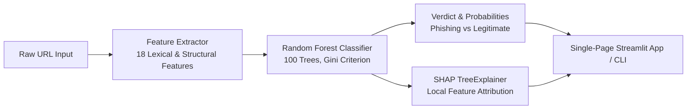

# 🛡️ Phishing URL Detection: ML + Cybersecurity + XAI

[](https://www.python.org/)
[](https://scikit-learn.org/)
[](https://streamlit.io/)
[](https://shap.readthedocs.io/)
[]()
[]()

An interactive, production-ready machine learning and **Explainable AI (XAI)** cybersecurity application that classifies URLs as **Phishing** or **Legitimate** in real-time.

Built upon the [PhiUSIIL Phishing URL Dataset](https://www.sciencedirect.com/science/article/pii/S0167404824000266), this application uses a trained **Random Forest** model with **18 lexical and structural features** alongside **SHAP (Shapley Additive Explanations)** to show not just *what* the model predicted, but *why* it made that decision.

---

## 🎯 System Architecture



---

## 🚀 Key Features

1. **Live URL Analyzer**: Input any custom URL or test instantly using 1-click curated attack and benign samples.
2. **Instant Threat Classification**: Real-time verdict badge (🔴 **PHISHING DETECTED** vs. 🟢 **LEGITIMATE URL**).
3. **Prediction Probability Metrics**: Exact class probabilities showing Phishing Risk Score (%) and Legitimate Score (%).
4. **18 Extracted Features (Collapsible View)**: An interactive expandable table (`st.expander`) displaying all 18 features, categories, values, SHAP impact scores, and descriptions.
5. **SHAP Explainability (XAI)**: Visual horizontal feature attribution plot displaying how each signal pushed the prediction relative to the dataset baseline prior.
6. **Top 5 Decision Drivers**: Ranked cards highlighting the top 5 most influential features with directional impact indicators and cybersecurity domain explanations.
7. **Dual-Interface Flexibility**: Includes both a single-page **Streamlit Web UI** and a terminal **CLI Scanner**.

---

## 📊 Dataset & Model Benchmarks

### Dataset Overview ([PhiUSIIL](https://www.sciencedirect.com/science/article/pii/S0167404824000266))

| Property | Value | Description |
| :--- | :--- | :--- |
| **Total Rows** | 235,795 | 235,370 unique URLs after deduplication |
| **Legitimate (`label = 1`)** | 134,850 (57.3%) | Verified authentic web domains |
| **Phishing (`label = 0`)** | 100,520 (42.7%) | Confirmed malicious / deceptive sites |
| **Evaluation Split** | 80% Train / 20% Test | Stratified holdout split (47,074 test URLs) |

### Model Test Performance

| Metric | Random Forest Score |
| :--- | :--- |
| **Accuracy** | **99.74%** |
| **Precision (Phishing)** | **99.91%** |
| **Recall (Phishing)** | **99.47%** |
| **F1-Score (Phishing)** | **99.69%** |
| **ROC-AUC** | **99.82%** |

---

## 🔬 The 18 Extracted Features

| # | Feature Name | Category | Description |
| :-: | :--- | :--- | :--- |
| 1 | `URLLength` | Structural Length | Total character count of the URL string |
| 2 | `DomainLength` | Domain Structure | Character count of the hostname / domain |
| 3 | `IsDomainIP` | Domain Security | Flag indicating raw IP address instead of domain (`1` = IP, `0` = Hostname) |
| 4 | `TLDLength` | Domain Structure | Length of the top-level domain suffix (`com`=3, `uk`=2, `online`=6) |
| 5 | `NoOfSubDomain` | Domain Structure | Number of subdomain levels |
| 6 | `HasObfuscation` | Obfuscation | Detection of percent-encoded hex characters (`%xx`) |
| 7 | `NoOfObfuscatedChar` | Obfuscation | Character count within hex obfuscations |
| 8 | `ObfuscationRatio` | Obfuscation | Ratio of obfuscated characters to URL length |
| 9 | `NoOfLettersInURL` | Character Composition | Total count of alphabetic characters `[a-zA-Z]` |
| 10 | `LetterRatioInURL` | Character Composition | Proportion of letters to URL length |
| 11 | `NoOfDegitsInURL` | Character Composition | Total count of numeric digits `[0-9]` |
| 12 | `DegitRatioInURL` | Character Composition | Proportion of digits to URL length |
| 13 | `NoOfEqualsInURL` | Query & Parameters | Count of `=` characters (query assignments) |
| 14 | `NoOfQMarkInURL` | Query & Parameters | Count of `?` characters (query string initiator) |
| 15 | `NoOfAmpersandInURL` | Query & Parameters | Count of `&` characters (parameter separators) |
| 16 | `NoOfOtherSpecialCharsInURL` | Special Characters | Non-alphanumeric characters excluding `=`, `?`, `&`, `%` |
| 17 | `SpacialCharRatioInURL` | Special Characters | Proportion of special characters to URL length |
| 18 | `IsHTTPS` | Transport Security | HTTPS encryption status (`1` = HTTPS, `0` = HTTP) |

---

## 📁 Repository Structure

```
phishing-url-detection/
├── app/
│   ├── __init__.py
│   └── main.py                     # Streamlit single-page application
├── data/
│   └── PhiUSIIL_Phishing_URL_Dataset.csv   # Dataset benchmark
├── models/
│   ├── .gitkeep
│   └── random_forest_model.joblib  # Serialized trained model artifact
├── notebook/
│   └── 01_dataset_analysis.ipynb   # Exploratory data analysis & model validation
├── src/
│   ├── __init__.py
│   ├── cli.py                      # Command-line scanning utility
│   ├── features.py                 # 18-feature extraction logic
│   ├── predict.py                  # Inference, SHAP calculation & interpretations
│   └── train.py                    # Model training pipeline
├── .gitignore
├── requirements.txt
└── README.md
```

---

## ⚡ Getting Started

### 1. Clone & Set Up Environment

```bash
git clone https://github.com/nikhi20-900/phishing-url-detection.git
cd phishing-url-detection

python3 -m venv venv
source venv/bin/activate
pip install -r requirements.txt
```

### 2. Launch the Streamlit Web App

```bash
streamlit run app/main.py
```

The app will open automatically in your browser at `http://localhost:8501`.

### 3. Scan URLs via Command Line (CLI)

You can analyze URLs directly in the terminal:

```bash
# Legitimate URL
python3 src/cli.py "https://www.google.com"

# Phishing URL (credential harvesting pattern)
python3 src/cli.py "http://paypal-security-update.com/login.php"

# Direct IP-based attack
python3 src/cli.py "http://34.149.138.117/"
```

Sample CLI output:
```text
🔍 Analyzing URL: http://paypal-security-update.com/login.php...

============================================================
VERDICT     : 🚨 PHISHING
PROBABILITY : 100.0% (Phishing)
RISK SCORES : Phishing: 100.0% | Legitimate: 0.0%
============================================================

🎯 TOP 5 INFLUENCING FEATURES (SHAP):
  1. IsHTTPS = 0.0
     Impact: Increases Phishing Risk (+0.1464)
     Note  : Unencrypted HTTP transport is a common hallmark of credential harvesting.

  2. NoOfSubDomain = 0.0
     Impact: Increases Phishing Risk (+0.1100)
     Note  : No subdomains present; direct apex or basic domain structure.

  3. LetterRatioInURL = 0.6977
     Impact: Increases Phishing Risk (+0.0983)
     Note  : Alphabetic composition (69.8%) analyzed against benign lexical profiles.

  4. NoOfOtherSpecialCharsInURL = 5.0
     Impact: Increases Phishing Risk (+0.0814)
     Note  : Unusually high punctuation/special characters (5) typical of complex redirects.

  5. SpacialCharRatioInURL = 0.1163
     Impact: Increases Phishing Risk (+0.0515)
     Note  : Special character ratio (11.6%) is elevated, indicating redirection syntax.
```

### 4. Retrain the Model

If you wish to retrain the model artifact from scratch:

```bash
python3 src/train.py
```

---

## 📖 Citation & References

- **Dataset Publication**: Prasad, A., & Chandra, S. (2024). *PhiUSIIL: A diverse security profile empowered phishing URL detection framework based on similarity index and incremental learning*. Computers & Security, 103545. [ScienceDirect Link](https://www.sciencedirect.com/science/article/pii/S0167404824000266).
- **SHAP (XAI)**: Lundberg, S. M., & Lee, S. I. (2017). *A unified approach to interpreting model predictions*. Advances in Neural Information Processing Systems (NeurIPS).
