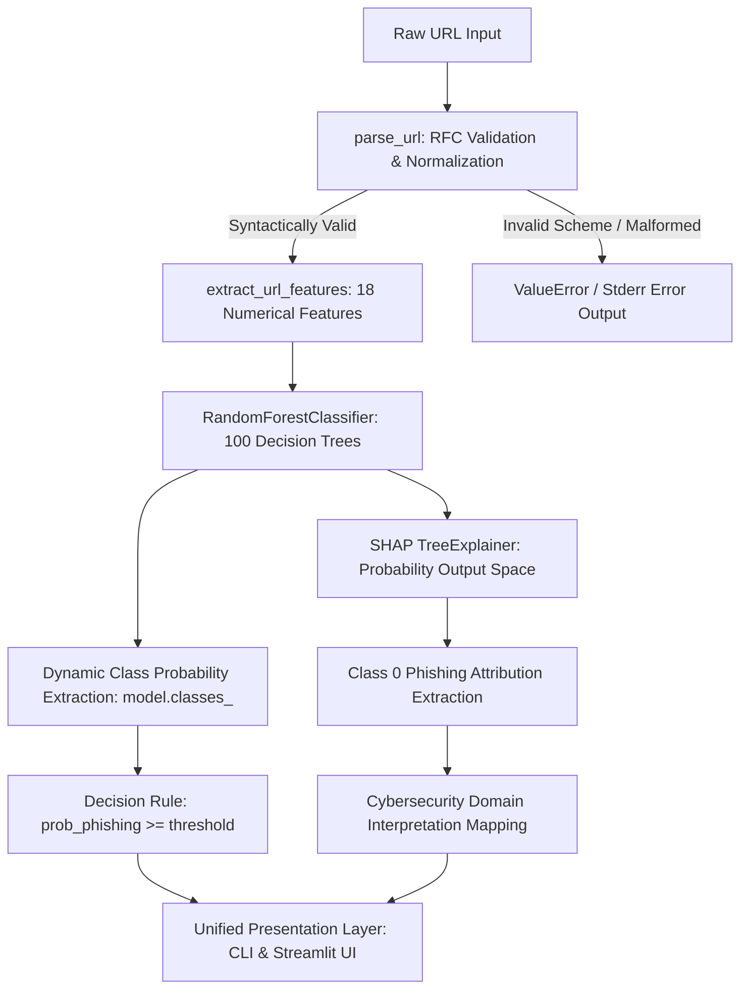

# Phishing URL Detection: Machine Learning and Explainable AI

[](https://www.python.org/)
[](https://scikit-learn.org/)
[](https://shap.readthedocs.io/)
[](https://streamlit.io/)
[]()
[]()
[]()

An end-to-end cybersecurity system designed to identify phishing URLs using structural, lexical, and transport signals. Built with a calibrated Random Forest classifier and local Explainable AI (SHAP) attributions, this project provides transparent, interpretable risk assessments rather than opaque black-box verdicts.

---

## Table of Contents

1. [Project Overview and Problem Statement](#1-project-overview-and-problem-statement)
2. [System Architecture](#2-system-architecture)
3. [Technology Stack and Repository Structure](#3-technology-stack-and-repository-structure)
4. [Dataset Description and Model Performance](#4-dataset-description-and-model-performance)
5. [The 18 Extracted URL Features](#5-the-18-extracted-url-features)
6. [URL Parsing and Feature Extraction Pipeline](#6-url-parsing-and-feature-extraction-pipeline)
7. [Random Forest Training and Inference Workflow](#7-random-forest-training-and-inference-workflow)
8. [Explainable AI with SHAP](#8-explainable-ai-with-shap)
9. [Installation and Environment Setup](#9-installation-and-environment-setup)
10. [Command-Line Interface (CLI)](#10-command-line-interface-cli)
11. [Streamlit Web Application](#11-streamlit-web-application)
12. [Automated Testing and Verification](#12-automated-testing-and-verification)
13. [Limitations and Responsible Use](#13-limitations-and-responsible-use)
14. [Reproducibility, Future Work, and References](#14-reproducibility-future-work-and-references)

---

## 1. Project Overview and Problem Statement

Phishing attacks remain one of the most widespread initial access vectors in cybersecurity. Adversaries frequently engineer deceptive web links designed to harvest credentials, deliver malware, or initiate fraud. Traditional defense mechanisms rely heavily on static blocklists and reputation feeds. While necessary, blocklists fail against zero-day campaigns, disposable ephemeral hostnames, domain generation algorithms (DGAs), and homograph attacks.

This project implements a machine learning system that evaluates URLs at the structural and lexical levels without requiring live HTTP requests to untrusted targets. The system extracts 18 domain, path, character distribution, and protocol features, classifies the target link using a trained Random Forest ensemble, and generates local feature attributions using SHAP (Shapley Additive Explanations).

### Primary Engineering Objectives

- **Safe Pre-Flight Analysis**: Analyze URLs purely through static lexical and structural properties, avoiding execution of malicious payloads or active network queries to attack infrastructure.
- **Explainability Over Black-Box Decisions**: Deliver quantifiable feature contributions (SHAP values) that explain why a URL was flagged as phishing or legitimate.
- **Robust URL Parsing**: Correctly handle edge cases including IPv4/IPv6 literals, custom ports, userinfo authority credentials, IDNA Punycode internationalized domains, and malformed structures.
- **Interface Parity**: Maintain identical feature extraction, probability alignment, and decision thresholds across both command-line (CLI) and web (Streamlit) interfaces.

---

## 2. System Architecture

The analysis pipeline processes arbitrary URL strings through strict syntactic validation, feature computation, ensemble classification, and Shapley attribution:


```mermaid
flowchart TD
    A["Raw URL Input"] --> B["parse_url: RFC Validation & Normalization"]
    B -->|"Syntactically Valid"| C["extract_url_features: 18 Numerical Features"]
    B -->|"Invalid Scheme / Malformed"| X["ValueError / Stderr Error Output"]
    C --> D["RandomForestClassifier: 100 Decision Trees"]
    D --> E["Dynamic Class Probability Extraction: model.classes_"]
    E --> F["Decision Rule: prob_phishing >= threshold"]
    D --> G["SHAP TreeExplainer: Probability Output Space"]
    G --> H["Class 0 Phishing Attribution Extraction"]
    H --> I["Cybersecurity Domain Interpretation Mapping"]
    F --> J["Unified Presentation Layer: CLI & Streamlit UI"]
    I --> J
```

---

## 3. Technology Stack and Repository Structure

### Technology Stack

| Layer | Component | Version / Library | Purpose |
| :--- | :--- | :--- | :--- |
| **Language** | Python | 3.10+ (tested through 3.14) | Core application and testing runtime |
| **Machine Learning** | scikit-learn | 1.9.0 | Random Forest ensemble classifier and evaluation metrics |
| **Explainable AI** | SHAP | 0.52.0 | TreeExplainer local attribution calculation |
| **Data Processing** | pandas, numpy | Modern releases | Feature representation and tabular structures |
| **Visualization** | matplotlib | Modern release | Rendered feature attribution horizontal bar plots |
| **Web UI** | Streamlit | 1.62.0 | Interactive cybersecurity analysis dashboard |
| **Model Storage** | joblib | 1.5.0 | Compressed model serialization and metadata caching |
| **Testing** | unittest | Python Standard Library | Unit, integration, and regression test suites |

### Repository Structure

```text
phishing-url-detection/
|-- app/
|   |-- __init__.py
|   `-- main.py                     # Streamlit web application
|-- data/
|   `-- PhiUSIIL_Phishing_URL_Dataset.csv   # Benchmark training dataset
|-- models/
|   |-- .gitkeep
|   `-- random_forest_model.joblib  # Trained model artifact with feature metadata
|-- notebook/
|   `-- 01_dataset_analysis.ipynb   # Exploratory analysis and model benchmarks
|-- src/
|   |-- __init__.py
|   |-- cli.py                      # Command-line interface with structured error handling
|   |-- features.py                 # RFC-compliant URL parser and 18-feature extraction
|   |-- predict.py                  # Dynamic probability mapping and SHAP local attribution
|   `-- train.py                    # Random Forest training pipeline
|-- tests/
|   |-- __init__.py
|   |-- test_cli.py                 # CLI execution and error exit tests (8 tests)
|   |-- test_feature_consistency.py # Feature extraction consistency tests (14 tests)
|   |-- test_prediction.py          # Prediction and probability mapping tests (13 tests)
|   |-- test_shap_explanations.py   # SHAP attribution and additive consistency tests (9 tests)
|   `-- test_url_parsing.py         # URL parsing and RFC validation tests (41 tests)
|-- .gitignore
|-- requirements.txt
`-- README.md
```

---

## 4. Dataset Description and Model Performance

### Dataset Overview

The model is trained on the [PhiUSIIL Phishing URL Dataset](https://www.sciencedirect.com/science/article/pii/S0167404824000266) (Prasad & Chandra, 2024), a comprehensive benchmark dataset compiled from verified benign sources and confirmed phishing feeds.

| Metric | Value | Details |
| :--- | :--- | :--- |
| **Raw Instances** | 235,795 | Total rows in dataset |
| **Cleaned Instances** | 235,370 | Unique URLs after deduplication |
| **Legitimate Instances** | 134,850 (57.3%) | Class label `1`: authentic web domains |
| **Phishing Instances** | 100,520 (42.7%) | Class label `0`: confirmed malicious destinations |
| **Train / Test Split** | 80% / 20% | Stratified holdout (188,296 train / 47,074 test) |
| **Random State** | 42 | Deterministic seed for reproducible evaluation |

### Ground Truth Class Label Mapping

The dataset encodes class labels as integers:

- **`0 = Phishing`** (Malicious / Deceptive)
- **`1 = Legitimate`** (Authentic / Safe)

Inference logic verifies this mapping dynamically via `model.classes_` rather than assuming index order.

### Evaluated Model Test Metrics

Metrics evaluated on the holdout test set (47,074 URLs) using features extracted by `src.features.extract_url_features`:

| Metric | Score | Description |
| :--- | :--- | :--- |
| **Overall Accuracy** | **99.72%** | Ratio of correctly classified URLs across both classes |
| **Phishing Precision** | **99.88%** | True phish divided by all instances flagged as phishing |
| **Phishing Recall** | **99.46%** | True phish detected divided by all actual phishing URLs |
| **Phishing F1-Score** | **99.67%** | Harmonic mean of phishing precision and recall |
| **ROC-AUC** | **0.9982** | Area under the Receiver Operating Characteristic curve |

---

## 5. The 18 Extracted URL Features

The feature extractor extracts 18 lexical and structural features for every input link:

| Index | Feature Name | Category | Calculation Method | Security Relevance |
| :-: | :--- | :--- | :--- | :--- |
| 1 | `URLLength` | Structural | Total character count of full URL string | Phishing URLs often use lengthy paths to obscure destination hosts |
| 2 | `DomainLength` | Structural | Character length of the hostname / FQDN | Extended domains or typo-squatted names inflate domain length |
| 3 | `IsDomainIP` | Domain Security | Binary flag: `1` if host is IPv4 or IPv6 literal, `0` otherwise | Direct IP addresses bypass domain reputation feeds and TLS SNI |
| 4 | `TLDLength` | Domain Structure | Character length of the top-level domain segment | Unconventional generic TLDs (e.g. `.online`, `.accountant`) exhibit distinct length profiles |
| 5 | `NoOfSubDomain` | Domain Structure | Count of subdomain levels separated by dots | Adversaries chain multi-level subdomains to simulate legitimate brand names |
| 6 | `HasObfuscation` | Obfuscation | Binary flag: `1` if percent-encoded hex sequences (`%xx`) are present | Hex encoding is frequently used to mask keywords or executable extensions |
| 7 | `NoOfObfuscatedChar` | Obfuscation | Total character count within valid hex-encoded sequences | Quantifies the volume of encoded content in the URL string |
| 8 | `ObfuscationRatio` | Obfuscation | Ratio of obfuscated characters to `URLLength` (3 decimals) | Relative density of encoded tokens within the full target string |
| 9 | `NoOfLettersInURL` | Lexical | Total count of alphabetic characters `[a-zA-Z]` | Core baseline for measuring lexical naturalness |
| 10 | `LetterRatioInURL` | Lexical | Ratio of alphabetic characters to `URLLength` (3 decimals) | Benign URLs typically exhibit high alphabetic ratios |
| 11 | `NoOfDegitsInURL` | Lexical | Total count of numeric digits `[0-9]` | High digit counts frequently appear in tracking hashes, IP hosts, or session IDs |
| 12 | `DegitRatioInURL` | Lexical | Ratio of numeric digits to `URLLength` (3 decimals) | High digit ratios correlate with machine-generated phishing links |
| 13 | `NoOfEqualsInURL` | Query Parameters | Total occurrences of the `=` character | Indicates active query parameters used for session forwarding or tracking |
| 14 | `NoOfQMarkInURL` | Query Parameters | Total occurrences of the `?` character | Flags query string delimiters; multiple `?` characters indicate malformed routing |
| 15 | `NoOfAmpersandInURL` | Query Parameters | Total occurrences of the `&` character | Delimits multiple parameter pairs in complex query strings |
| 16 | `NoOfOtherSpecialCharsInURL` | Punctuation | Count of special characters excluding `=`, `?`, `&`, `%` | Punctuation characters (`/`, `-`, `_`, `@`, `.`) used in path routing |
| 17 | `SpacialCharRatioInURL` | Punctuation | Ratio of all special characters (including query delimiters) to length | High special character density often indicates multi-level directory traversal |
| 18 | `IsHTTPS` | Protocol Transport | Binary flag: `1` if scheme is HTTPS, `0` if HTTP | While phishing increasingly adopts HTTPS, plain HTTP remains a strong threat signal |

---

## 6. URL Parsing and Feature Extraction Pipeline

URL parsing in `src/features.py` implements strict syntactic validation before feature computation:

### Validation and Normalization Rules

- **Protocol Enforcement**: Restricts schemes to `http` and `https`. Unsupported protocols (`ftp:`, `javascript:`, `mailto:`, `data:`) raise a structured `ValueError`. Schemeless URLs (e.g. `www.google.com`) safely default to `http://`.
- **Authority and Credential Parsing**: Detects userinfo masking attacks. For deceptive links such as `https://trusted-bank.com@attacker.com`, the authority parser separates credentials from the destination host, correctly identifying `attacker.com` as the target domain while recording `has_credentials = 1`.
- **Port Syntax and Range**: Validates explicit ports against the RFC integer range ($1 \le \text{port} \le 65535$). Non-numeric or out-of-range ports are rejected.
- **IPv4 and IPv6 Detection**: Identifies 4-octet dotted IPv4 addresses and bracketed IPv6 literals (e.g. `[::1]`, `[2001:db8::1]:8080`). Rejects malformed structures such as octets $> 255$ or non-4-octet dotted strings.
- **Domain Label Syntax**: Rejects empty labels, consecutive dots (`..`), invalid hyphens at label boundaries, and labels exceeding 63 characters (RFC 1035).
- **Internationalized Domain Names (IDNA)**: Normalizes non-ASCII Unicode domain names (e.g. `bücher.de`) to ASCII Punycode (`xn--bcher-kva.de`) via the IDNA standard.

---

## 7. Random Forest Training and Inference Workflow

### Model Hyperparameters

The classification model is a scikit-learn `RandomForestClassifier` configured for deterministic reproducibility:

```python
RandomForestClassifier(
    n_estimators=100,
    criterion="gini",
    max_features="sqrt",
    random_state=42,
    n_jobs=-1
)
```

### Feature Consistency

To prevent distribution drift and training-serving skew, `src/train.py` applies the exact same `extract_url_features()` function directly to raw URLs during training:

```python
# From src/train.py
feats = [extract_url_features(u) for u in df_clean["URL"]]
X = pd.DataFrame(feats, columns=FEATURE_NAMES)
y = df_clean["label"]
```

### Dynamic Class Probability Alignment

Because scikit-learn stores class identifiers in `model.classes_`, prediction code must never assume that index `0` corresponds to label `0`. In `src/predict.py`, `get_class_probabilities()` dynamically maps probabilities:

```python
classes = list(model.classes_)
phishing_index = classes.index(0)
legitimate_index = classes.index(1)

prob_phishing = float(probabilities[phishing_index])
prob_legitimate = float(probabilities[legitimate_index])
```

### Decision Threshold

The decision boundary is governed by a configurable `threshold` parameter (default: `0.5`):

```text
is_phishing = prob_phishing >= threshold
```

In high-risk operational environments where minimizing false negatives is critical, the threshold can be lowered (e.g. `threshold=0.35`) to flag borderline URLs for secondary inspection.

---

## 8. Explainable AI with SHAP

### TreeExplainer Output Space

Explainability is implemented via `shap.TreeExplainer`. For a scikit-learn `RandomForestClassifier`, each leaf node represents the proportion of training instances per class, meaning `TreeExplainer` operates in **probability space**:

$$\text{Predicted Probability} = \text{Base Value} + \sum_{i=1}^{18} \phi_i$$

where $\text{Base Value}$ is the prior probability of phishing across the training data ($\approx 42.7\%$), and $\phi_i$ represents the local additive contribution of feature $i$ for that specific URL.

### Phishing Class Orientation

To prevent ambiguity, all SHAP explanations specifically target **Class 0 (Phishing)**:

- **Positive SHAP Value ($\phi_i > 0$)**: The feature increased the phishing probability (pushed the prediction toward Phishing).
- **Negative SHAP Value ($\phi_i < 0$)**: The feature reduced the phishing probability (supported a Legitimate classification).

When a URL receives a **Legitimate** verdict, the explanations explicitly state which features reduced phishing risk (e.g., active HTTPS encryption, standard domain length, zero hex obfuscation).

---

## 9. Installation and Environment Setup

### Prerequisites

- Python 3.10, 3.11, 3.12, 3.13, or 3.14
- Git

### Setup Instructions

```bash
# 1. Clone the repository
git clone https://github.com/nikhi20-900/phishing-url-detection.git
cd phishing-url-detection

# 2. Create and activate a virtual environment
python3 -m venv venv
source venv/bin/activate

# 3. Upgrade pip and install dependencies
pip install --upgrade pip
pip install -r requirements.txt
```

---

## 10. Command-Line Interface (CLI)

The command-line interface provides fast, scriptable threat scanning.

### Basic Usage

```bash
python3 src/cli.py "<URL>"
```

### Examples

**Analyzing a legitimate domain:**

```bash
python3 src/cli.py "https://www.google.com"
```

Output:
```text
Analyzing URL: https://www.google.com...

============================================================
VERDICT     : LEGITIMATE
PROBABILITY : 99.8% (Legitimate)
RISK SCORES : Phishing: 0.2% | Legitimate: 99.8%
============================================================

TOP 5 INFLUENCING FEATURES (SHAP):
  1. IsHTTPS = 1.0
     Impact: Supports Legitimate (-0.1651)
     Note  : HTTPS is active, establishing encrypted transport standard for genuine domains.

  2. NoOfOtherSpecialCharsInURL = 1.0
     Impact: Supports Legitimate (-0.1178)
     Note  : Minimal special characters (1) aligns with clean site architecture.

  3. DomainLength = 14.0
     Impact: Increases Phishing Risk (+0.0550)
     Note  : Domain length (14 chars) contributed toward the phishing classification based on patterns learned from the training data.

  4. SpacialCharRatioInURL = 0.045
     Impact: Supports Legitimate (-0.0534)
     Note  : Special character ratio (4.5%) within expected baseline bounds.

  5. LetterRatioInURL = 0.409
     Impact: Supports Legitimate (-0.0420)
     Note  : Alphabetic composition (40.9%) contributed toward the classification based on lexical distributions in the training data.
```

**Analyzing a raw IP-based attack URL:**

```bash
python3 src/cli.py "http://198.98.58.123/"
```

Output:
```text
Analyzing URL: http://198.98.58.123/...

============================================================
VERDICT     : PHISHING
PROBABILITY : 100.0% (Phishing)
RISK SCORES : Phishing: 100.0% | Legitimate: 0.0%
============================================================

TOP 5 INFLUENCING FEATURES (SHAP):
  1. IsHTTPS = 0.0
     Impact: Increases Phishing Risk (+0.2399)
     Note  : Unencrypted HTTP transport contributed toward the phishing classification, as absence of TLS is prevalent among deceptive links in the training data.

  2. NoOfOtherSpecialCharsInURL = 4.0
     Impact: Increases Phishing Risk (+0.1161)
     Note  : Special character count (4) contributed toward the phishing classification based on patterns learned from the training data.

  3. NoOfDegitsInURL = 10.0
     Impact: Increases Phishing Risk (+0.1022)
     Note  : Digit composition (10 digits) contributed toward the phishing classification based on patterns learned from the training data.
```

### CLI Error Handling

Invalid URLs produce clean messages on `stderr` and terminate with a non-zero exit status (`1`):

```bash
python3 src/cli.py "ftp://malicious.site"
# Stderr: Error: Unsupported scheme 'ftp'. Only HTTP and HTTPS URLs are supported.
# Exit code: 1

python3 src/cli.py "http://example.com:99999"
# Stderr: Error: Invalid URL port: Port out of range 0-65535
# Exit code: 1
```

---

## 11. Streamlit Web Application

The interactive web dashboard provides an interface for security analysts and end users.

### Launching the Dashboard

```bash
streamlit run app/main.py
```

The application will be accessible at `http://localhost:8501`.

### Key Interface Components

- **Unified Threat Banner**: Displays classification verdict (Phishing vs. Legitimate) alongside exact model confidence percentages.
- **Probability Meter**: Dual progress bars contrasting Phishing Score against Legitimate Score.
- **Top 5 Decision Drivers**: Ranked cards detailing the strongest local SHAP signals, their direction, and cybersecurity context.
- **Visual Attribution Plot**: A horizontal bar plot illustrating how each signal moved the probability relative to baseline prior.
- **Collapsible Feature Table**: Expandable view listing all 18 extracted values, feature categories, raw values, and individual SHAP impact scores.
- **Attack Samples**: Pre-configured selector for testing credential harvesting, worker scripts, and IP attacks.

---

## 12. Automated Testing and Verification

The repository includes an automated test suite comprising **85 unit, integration, and regression tests**.

### Running the Test Suite

```bash
python3 -m unittest discover tests -v
```

### Test Coverage by Module

| Test Module | Test Count | Scope of Verification |
| :--- | :-: | :--- |
| `tests/test_url_parsing.py` | 41 | Schemes, ports, credentials in authority, IPv4 octet bounds, bracketed IPv6, IDNA Punycode, malformed hosts |
| `tests/test_feature_consistency.py` | 14 | 18-feature schema, ratio bounds [0, 1], 3-decimal rounding, dot-split IP handling, dataset row parity |
| `tests/test_prediction.py` | 13 | Dynamic probability extraction, reversed `model.classes_`, threshold boundary conditions, interface parity |
| `tests/test_shap_explanations.py` | 9 | Phishing class index targeting, 2D/3D output shapes, finite value checks, additive consistency ($10^{-15}$ precision) |
| `tests/test_cli.py` | 8 | Subprocess invocation, exit codes (0 vs. 1), clean stderr error formatting, validation rejection |
| **Total Test Count** | **85** | **All 85 tests passing** |

### Whitespace and Git Integrity Verification

```bash
git diff --check
```

---

## 13. Limitations and Responsible Use

### Probabilistic Nature

Model outputs are statistical estimates based on patterns learned from training data, not absolute guarantees of safety or malice.

- A URL flagged as **Legitimate (99.8%)** indicates strong structural resemblance to authentic web architecture; it does not guarantee that the remote server has not been compromised or host malicious content.
- A URL flagged as **Phishing (100.0%)** reflects severe malicious structural indicators (e.g. unencrypted IP address with high special-character ratios); organizations should treat this as a high-risk indicator for automated isolation or analyst review.

### Evasion Techniques and Threat Evolution

- **Adversarial Adaptation**: Sophisticated threat actors may mimic legitimate URL structures (e.g., using short HTTPS domain names with clean paths) to minimize lexical anomaly scores.
- **Defense-in-Depth**: This tool should be deployed as one layer of a multi-tiered security architecture alongside DNS filtering, SSL inspection, behavioral sandboxing, and endpoint protection.
- **No Payload Execution**: This system does not inspect DOM structure, JavaScript execution, or SSL certificate chains.

---

## 14. Reproducibility, Future Work, and References

### Model Retraining

To retrain the Random Forest model artifact from the raw dataset:

```bash
python3 src/train.py
```

### Future Enhancements

- **Ensemble Comparison**: Integrate gradient-boosted trees (XGBoost, LightGBM) as comparative models (preliminary exploration documented in `notebook/01_dataset_analysis.ipynb`).
- **External Telemetry**: Incorporate WHOIS domain age and passive DNS signals to augment lexical indicators.
- **FastAPI Endpoint**: Package the inference pipeline as a containerized REST API for integration into security orchestration platforms (SOAR).

### References

1. **Dataset Publication**: Prasad, A., & Chandra, S. (2024). *PhiUSIIL: A diverse security profile empowered phishing URL detection framework based on similarity index and incremental learning*. Computers & Security, 138, 103545. [DOI: 10.1016/j.cose.2024.103545](https://doi.org/10.1016/j.cose.2024.103545).
2. **Explainable AI (SHAP)**: Lundberg, S. M., & Lee, S. I. (2017). *A unified approach to interpreting model predictions*. Advances in Neural Information Processing Systems (NeurIPS 30).
3. **URL Standards**: Berners-Lee, T., Fielding, R., & Masinter, L. (2005). *Uniform Resource Identifier (URI): Generic Syntax*. RFC 3986, Internet Engineering Task Force (IETF).
